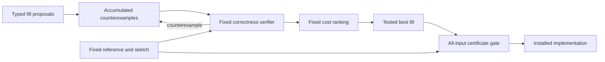

# lean-abstractification

[](https://github.com/alok/lean-abstractification/actions/workflows/lean.yml)

A runnable Lean 4 research draft interpreting Alperen Keleş's
[Abstractification](https://alperenkeles.com/documents/abstractification.pdf): freeze a program sketch
and its specification, propose typed fills, check correctness, and rank passing candidates. Our Lean
interpretation adds a separate proof gate before a fill becomes a certified implementation.

## Run

Install [elan](https://github.com/leanprover/elan) and Python 3. Lean is pinned to **4.34.1**, with no
third-party Lean package dependencies.

```sh
sh scripts/check.sh
# Or just build and run:
lake build
lake exe abstractificationDemo
```

The checks build both libraries, audit installed declarations, require 11 negative fixtures to fail
for their intended reasons, and run the demo. CI repeats the suite on Linux using pinned actions.

## A concrete end-to-end sketch

[Examples/IsolateZero.lean](Examples/IsolateZero.lean) adapts Figure 3's fixed expression
`~(x + left) & (x + right)` to **8-bit wrapping words**. An independent reference scans for the least
significant zero bit. Lean proves that fill `(0, 1)` agrees with the reference on **all 256 inputs**,
including overflow at 255. `(0, 0)` has a certified counterexample at input zero.

[Examples/Search.lean](Examples/Search.lean) starts with a replay corpus `[255]`, tries a fixed list
of closed proposal values, and accumulates counterexamples. An incorrect fill passes replay but
fails full verification at zero; the next incorrect fill is rejected using that accumulated example.
Only verifier-passing candidates get scores. A separate all-input decision procedure supplies the
proof required for installing the selected fill.

| Declared workload | Winner | Toy operation count |
|---|---|---:|
| `[127, 255]` | bit sketch `(0, 1)` | 8, versus 16 for scanning |
| `[0, 0, 0, 0]` | reference scan | 4, versus 16 for the bit sketch |

These are kernel-checked results about an explicit toy cost model. They are **not elapsed-time
measurements**, a speedup claim, a 32-bit proof, or a reproduction of the paper's Rust allocation
experiment. The proposer is deterministic and finite; it does not invoke an LLM or external solver.

## Lean DSL and metaprogramming

```lean
import Abstractification
open Abstractification

abstractify doubling
  input: Nat output: Nat holes: Nat observation: Nat
  reference: (fun n ↦ n + n)
  sketch: (fun multiplier n ↦ n * multiplier)
  observing: id
  requiring: (fun _ ↦ True)

def doubled : Installed doubling :=
  install% 2 certified_by (by intro n _; exact Nat.mul_two n)

#audit_install doubled
```

`abstractify` generates the fixed boundary. The `install%` elaborator gets the expected boundary
from Lean's type checker, checks the fill and proof, and audits transitive constants, types, and
reachable local let bindings. Its explicit allowlist is `propext`, `Classical.choice`, and `Quot.sound`.
The bit certificates actually depend only on `propext` and `Quot.sound`; the doubling example has
no axiom dependencies. `sorryAx`, custom axioms, and native-decision trust axioms are rejected.

A `draft_hole% name` reports its expected type and local context and **fails elaboration**. It never
supplies an admitted or default executable value. This provides one building block for Agda-style
editing; refinement, case splitting, editor code actions, and a complete `lean-holes` rewrite remain
future work. Existing interactive-hole code was inspected read-only and not copied.



## Evidence and limits

The boundary theorem establishes equality of the **declared observations**, on inputs satisfying the
**declared precondition**. It does not prove that the specification captures the intended behavior.
Replay-only testing can select a bad fill; a regression demonstrates that the independent certificate
gate rejects it. Negative fixtures deliberately contain admissions and invented axioms; accepted
implementation modules do not.

Ordinary Lean can construct `Installed` directly using an axiom; the type alone is not an axiom
policy. Use the audited DSL or `#audit_install`, and run the checks. Elaborating arbitrary Lean is
not an OS sandbox. Logical proofs do not verify foreign code, `implemented_by` substitutions,
allocation failures, machine performance, or the compiler itself. The demo's candidate language is
closed data, and its driver changes only fills. See [design](docs/design.md),
[source notes](docs/sources.md), and [verification and review](docs/verification.md).

## Attribution

Direction and scope: **Alok**. Implementation, research assistance, and independent AI review:
**OpenAI Codex, GPT-6.1 Sol**, including parallel assistance. This is our research draft; no human
verification is claimed. The abstractification proposal is **Alperen Keleş's**, building on the
sketching, synthesis, contracts, and testing literature he cites. The bit sketch is an adaptation of
that prior work, not a new bit trick. See [NOTICE](NOTICE).

No official implementation was located in the bounded public-source search. This is an original
Lean interpretation, not an upstream port. The paper is linked rather than redistributed. Original
code is MIT licensed; third-party toolchains and actions retain their own licenses.
